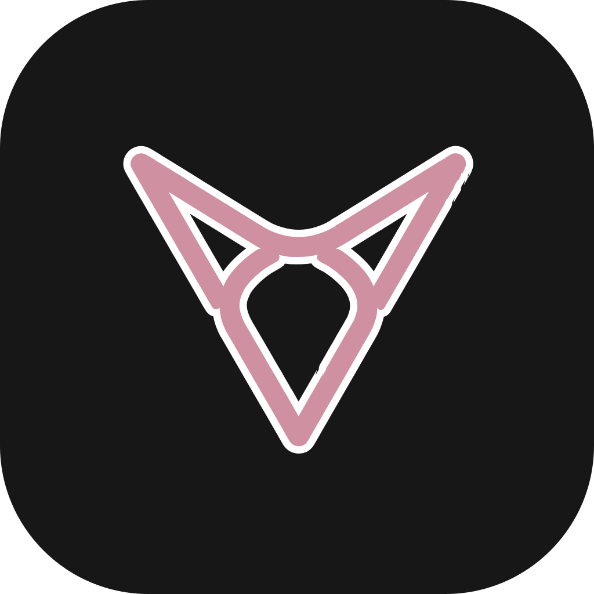
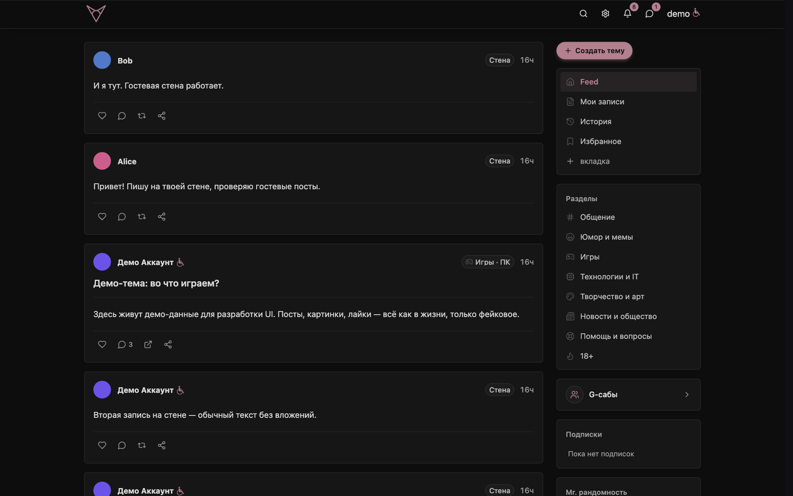
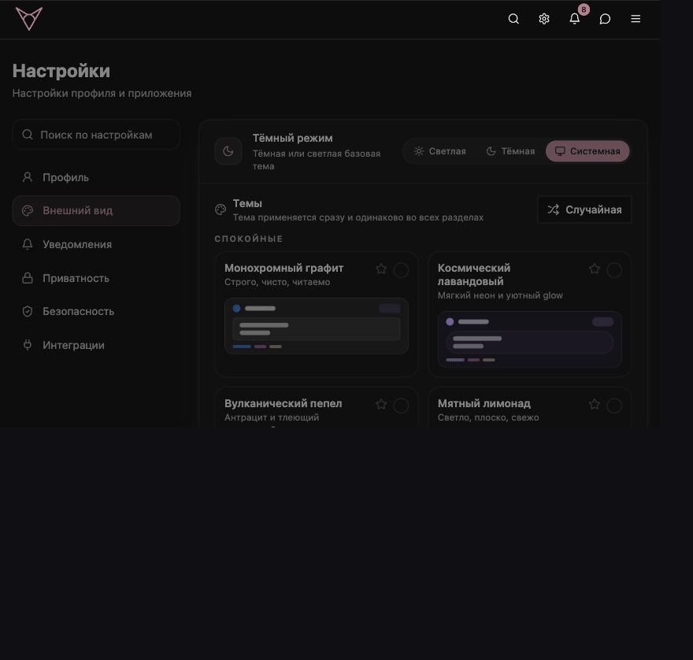
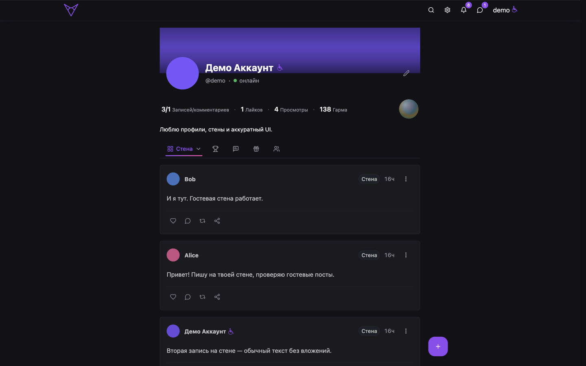
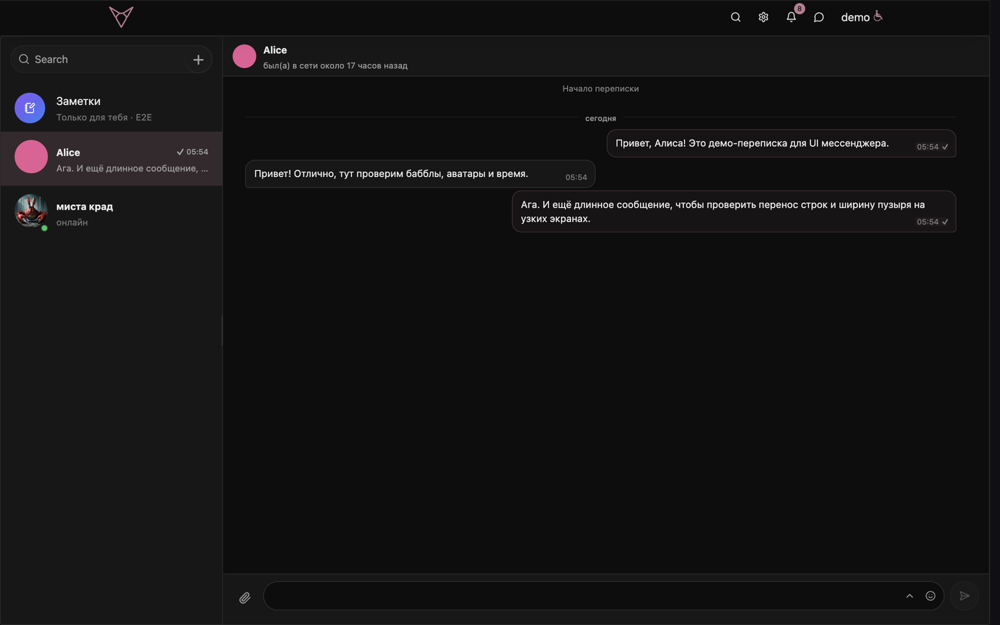
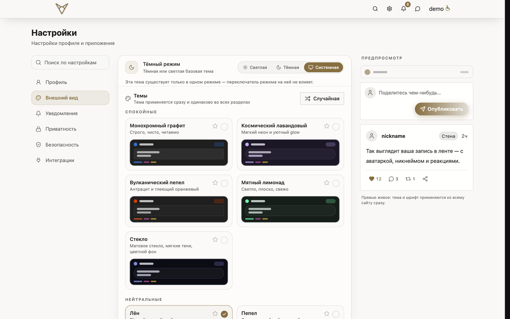
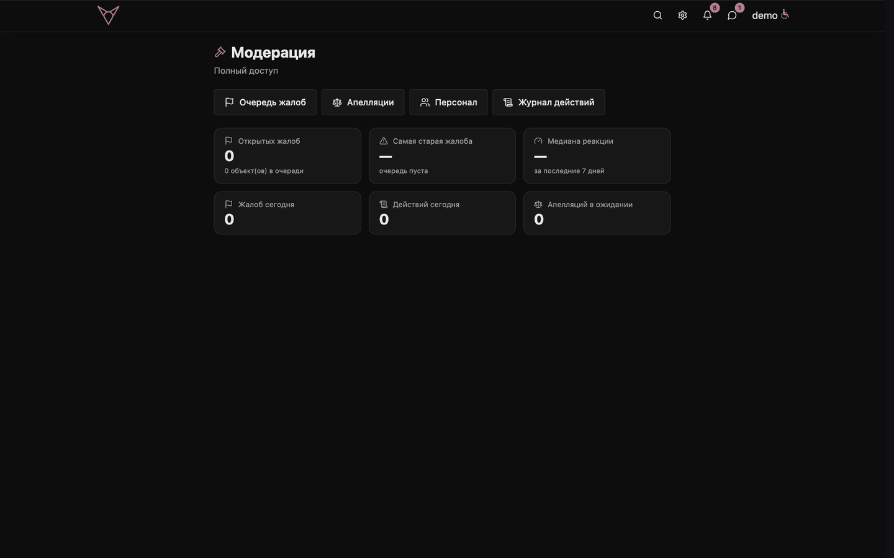

<div align="center">



# gomo6

**Социальная сеть с форумом, досками и темами, шифрованным мессенджером и сообществами в духе Discord.**

<a href="README.md"></a>
<a href="README.ru.md"></a>

<a href="https://github.com/elcrazycol/gomo6.2/actions/workflows/deploy.yml"></a>
<a href="https://github.com/elcrazycol/gomo6.2/releases"></a>
<a href="LICENSE.md"></a>
<a href="https://github.com/elcrazycol/gomo6.2"></a>


**Живой инстанс → [gomo6.wtf](https://gomo6.wtf)**

</div>

---

## О проекте

gomo6 — социальная сеть целиком: персональная лента из досок и тем, стены профилей со студией оформления, шифрованный мессенджер, сообщества в духе Discord (GomoSubs) сразу с форумными каналами и живым текстовым чатом, достижения, свои наборы эмодзи — и поиск на отдельном движке, а не на SQL `LIKE`.

Бэкенд — **Go (Gin)** на PostgreSQL, Redis, Garage (S3-совместимое хранилище) и Meilisearch. Фронтенд — **React 18 + TypeScript + Vite**. Всё это один монорепозиторий (Turborepo + npm workspaces) и один Docker Compose за Caddy на одном VPS. Деплой идёт через GitHub Actions в `ghcr.io`, а VPS только тянет готовые образы и никогда ничего не собирает.

## Скриншоты

Ниже — настоящий инстанс, поднятый локально на [демо-данных](scripts/seed.sh).

**Лента** — доски, темы и посты стен в одном потоке, с боковой панелью разделов и подписками.



**18 встроенных тем**, светлых и тёмных, применяются мгновенно ко всему приложению.



<table>
<tr>
<td width="50%"><br><sub><b>Профиль</b> — стена и гостевые посты, статистика (записи / лайки / просмотры / гарма), вкладки достижений, постов, подарков и друзей</sub></td>
<td width="50%"><br><sub><b>Мессенджер</b> — диалоги, заметки для себя (шифрование в браузере), галочки прочтения, присутствие</sub></td>
</tr>
<tr>
<td><br><sub><b>Настройки → внешний вид</b> — темы с живым предпросмотром, режимы светлый / тёмный / системный</sub></td>
<td><br><sub><b>Модерация</b> — очередь жалоб, апелляции, персонал и журнал действий</sub></td>
</tr>
</table>

<sub>Ещё: <a href="docs/assets/readme/feed-lavender.png">лента в теме «космический лавандовый»</a> · <a href="docs/assets/readme/feed-scroll.gif">скролл ленты</a></sub>

## Возможности

| Область | Что есть |
|---|---|
| **Лента и доски** | Персональная лента из тем и постов стен, доски и разделы, темы, посты, комментарии, лайки, репосты, реакции эмодзи, вложения (картинки, видео, аудио, файлы), встроенный видеоплеер, редактор фото |
| **Профили** | Стена с обычными и гостевыми постами, студия оформления (фоны, градиенты, тени, CSS ника, значки), история аватаров, гарма (карма за активность), статистика профиля, присутствие онлайн, друзья и подписки |
| **Мессенджер** | Личные и групповые чаты, заметки для себя с шифрованием в браузере, шифрование сообщений на сервере, редактирование и удаление, галочки прочтения, присутствие, вложения, мобильный интерфейс |
| **GomoSubs** | Сообщества в духе Discord: форумные каналы и живой текстовый чат внутри одного сообщества, роли и права, инвайты |
| **Поиск** | Поиск на Meilisearch по людям, доскам, темам, постам и постам стен, с фильтрами по типу, автору и дате. Если движок не настроен или упал, API деградирует до полнотекстового поиска в PostgreSQL |
| **Достижения** | Карточки достижений с уровнями, секретные открытия, ступени редкости (common → mythic) и награда гармой |
| **Наборы эмодзи** | Свои наборы эмодзи — любой пользователь может создать набор, загрузить эмодзи и поделиться им |
| **Подарки** | Коллекционные подарки со слоистой отрисовкой |
| **Приватность** | Приватные профили, приватные и скрытые стены, доступ по взаимной дружбе, видимость по типам контента; приватное содержимое вообще не попадает в поисковый индекс |
| **Модерация** | Очередь жалоб, апелляции, управление персоналом и append-only журнал действий (для админов и модераторов инстанса) |
| **Уведомления** | Уведомления в интерфейсе и Web Push (PWA, VAPID) |
| **Безопасность** | JWT с refresh-токенами, TOTP-двухфакторка, пасскеи WebAuthn, защита от CSRF, лимиты по поверхностям API, шифрование сообщений, антибот Cloudflare Turnstile. Аудиты безопасности проходят регулярно |
| **Локализация** | Русский и английский интерфейс с предложениями переводов от сообщества и голосованием за них |
| **PWA и доставка** | Устанавливаемое PWA с кешем service worker, HTTP/3, сжатие zstd/gzip, разделённые бандлы |
| **Наблюдаемость** | Свой стек VictoriaMetrics (vmagent → VictoriaMetrics → vmalert → Alertmanager/Telegram, дашборды Perses), метрики Prometheus, Sentry RUM |
| **Платформа для разработчиков** | OAuth 2.0 / OpenID Connect с экраном согласия и панель разработчика для приложений и ботов; SDK для ботов живёт в этом же репозитории и пока ранний |

## Стек

| Слой | Технологии |
|---|---|
| API и реальное время | Go 1.26, Gin, WebSocket-хаб с подписками по комнатам |
| Данные | PostgreSQL 18, Redis 7, Meilisearch 1.53, Garage 2.3 (S3-совместимое) |
| Веб | React 18, TypeScript 5, Vite, Tailwind, Radix UI, Zustand, TanStack Query |
| Доставка | nginx (статика), Caddy 2 (TLS, HTTP/3, сжатие) |
| Сборка и деплой | Turborepo + npm workspaces, Docker Compose, GitHub Actions, `ghcr.io` |
| Качество | golangci-lint, gofmt/go vet, ESLint, `tsc`, Vitest, gitleaks, hadolint, govulncheck, CodeQL/Trivy по расписанию, Codecov |

## Быстрый старт

```bash
make dev
```

Одна команда поднимает всё — инфраструктуру в Docker, секреты, зависимости и все дев-серверы:

```
http://localhost:8081        веб-приложение
http://localhost:3001        документация для разработчиков
http://localhost:3002        панель разработчика
http://localhost:8080/health бэкенд
```

Нужны **Docker**, **Node 22+**, **npm**, **Go 1.26+**, **openssl** и **tmux** либо **overmind** (ставится `make tools`) для менеджера процессов; **ffmpeg** — если хотите, чтобы локально работала загрузка видео. `make doctor` проверяет все предпосылки, демон Docker, `.env` и дев-порты.

Наполнить интерфейс содержимым — ещё одна команда:

```bash
make seed        # идемпотентные демо-данные: профиль, стена, друзья, лента, переписка
```

Демо-вход: `demo@gomo6.local` / `gomo6-demo-9f3k2x` (ещё `alice@` и `bob@`, пароль тот же).

<details>
<summary><b>Цели make</b></summary>

| Цель | Что делает |
|---|---|
| `make dev` | Полное дев-окружение одной командой |
| `make attach` | Вернуться в tmux-сессию `make dev` |
| `make dev-stop` | Остановить дев-процессы (инфраструктура остаётся) |
| `make seed` | Залить демо-данные в локальную БД |
| `make doctor` | Проверить предпосылки, Docker, `.env` и порты |
| `make infra` | Postgres + Redis + Meilisearch + Garage на localhost |
| `make backend` | Запустить Go-бэкенд на :8080 |
| `make web` | Дев-серверы фронтендов (web, docs, dev-dashboard) |
| `make test` / `make lint` / `make typecheck` | Тесты, линтеры, `tsc --noEmit` |
| `make psql` / `make redis-cli` / `make logs` | Заглянуть в локальную инфраструктуру |
| `make reset-db` | **Разрушительно** — удалить дев-тома |

Полный список с описаниями — `make help`.

</details>

## Структура репозитория

| Приложение | Стек | Что это |
|---|---|---|
| [`apps/web`](apps/web) | React 18 + Vite + Tailwind | Интерфейс социальной сети |
| [`apps/backend-go`](apps/backend-go) | Go + Gin + Postgres + Redis + Meilisearch + Garage | REST API и WebSocket-хаб |
| [`apps/docs`](apps/docs) | TypeScript + Vite | Документация для разработчиков |
| [`apps/dev-dashboard`](apps/dev-dashboard) | TypeScript + Vite | Панель разработчика: OAuth-приложения, боты, подарки |
| [`packages/bot-sdk`](packages/bot-sdk) | TypeScript | SDK для ботов (ранняя стадия) |

## Деплой

Пуш в `main` → GitHub Actions прогоняет проверки, собирает изменившиеся сервисы на своём раннере, пушит образы в `ghcr.io` и перезапускает на VPS ровно эти сервисы:

```
гейт CI → план (что изменилось) → buildx build --push → pull + compose up на VPS
```

VPS маленький (1 vCPU / 1 ГБ) и не собирает ничего сам — только тянет образы и перезапускает контейнеры. Полный гайд, секреты и ручной деплой: **[docs/wiki/DEPLOYMENT.md](docs/wiki/DEPLOYMENT.md)**.

## Документация

- **Документация для разработчиков** — живой сайт ([`apps/docs`](apps/docs)): быстрый старт для ботов, события, API и сценарии OAuth 2.0
- **Wiki** ([`docs/wiki`](docs/wiki)) — деплой, Docker, OAuth API, модель безопасности мессенджера, паттерны WebSocket, дизайн системы присутствия, вложения
- **История версий** — [CHANGELOG.md](CHANGELOG.md) (Keep a Changelog + SemVer, версия в файле [`VERSION`](VERSION))

## Участие

Issues и пул-реквесты приветствуются. Начните с [CONTRIBUTING.md](CONTRIBUTING.md) — там же ритуал релиза и правила нумерации версий. Перед пушем `./scripts/ci-local.sh quick` прогонит те же линтеры и проверки типов, что и CI, а pre-commit hook (`git config core.hooksPath .githooks`) проверяет изменённые пакеты на каждом коммите.

## Лицензия

[AGPL-3.0](LICENSE.md) — gomo6 можно использовать, изучать, изменять и поднимать у себя; производные сетевые сервисы обязаны оставаться открытыми.
